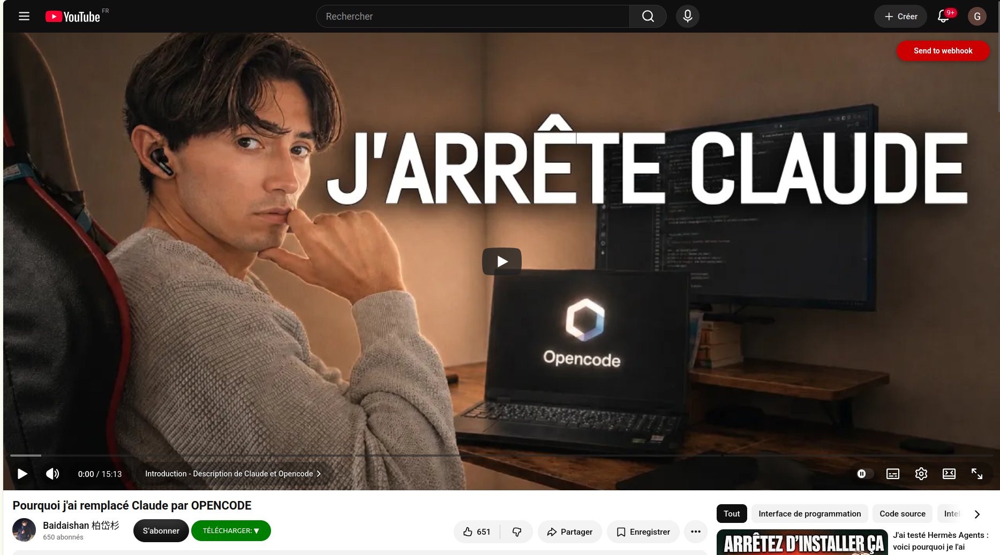

# YouTube Transcript → LLM Synthesis → Notion (n8n workflow)

n8n workflow that takes a YouTube video URL, pulls its transcript, rewrites it into a clean and structured document via an LLM, and pushes everything into a Notion database — with a built-in recovery path so nothing has to restart from scratch after a partial failure.

## What it does

1. **Trigger** — a webhook (`Start - Request from original userscript`) receives a `POST` with a video `title` and `url`, typically fired from a browser userscript running on YouTube.
2. **State tracking** — the request is immediately saved into an n8n Data Table (`Youtube_extractor_states`) so the run can be resumed later if anything fails downstream.
3. **Dedup / resume check** — before doing any work, the workflow searches the Notion database for an existing page for that URL, and checks the Data Table for a transcript or processed transcript that may already exist from a previous, interrupted run. It only does the work that's actually missing.
4. **Notion page creation** — if no page exists yet, a new page is created in the Notion "Vidéos" database with the video title, URL, source (`Youtube`) and status (`Pending consultation`).
5. **Transcript extraction** — the raw transcript is fetched via [Supadata](https://supadata.ai) and saved both to the Data Table and, later, to Notion.
6. **LLM rewrite** — the raw transcript is rewritten into a dense, well-structured Markdown document (not a summary — all information is preserved, filler and spoken-language noise removed). The primary model is Mistral Cloud, with an OpenRouter model (Qwen) configured as a fallback.
7. **Notion upload** — both the processed (readable) transcript and the raw transcript are appended to the Notion page as Markdown blocks, under a collapsible "Transcript" toggle.
8. **Checkpointing** — after each step, the corresponding Notion checkboxes (`Transcript processé`, `Transcript`) and a `Log` field are updated, so the page itself reflects exactly how far processing got.
9. **Error handling** — any failure (transcript processing or Notion upload) is logged directly onto the Notion page's `Log` property and stops the execution with an explicit error, instead of failing silently.

## Recovery path

The same webhook path also powers a **manual recovery button** in Notion (`Manual recovery from Notion button`): a URL button on the page that re-triggers the workflow with the video URL and Notion page ID. Because every step re-checks Notion properties and the Data Table before doing work, re-running the workflow on a page that already has a raw transcript but failed at the LLM step will skip straight to reprocessing — it won't re-fetch the transcript or duplicate the Notion page. This makes the workflow safe to re-run at any point after a partial failure.

## Requirements

- An [n8n](https://n8n.io/) instance (self-hosted or cloud) with:
  - [`n8n-nodes-supadata`](https://www.npmjs.com/package/n8n-nodes-supadata) community node
  - [`n8n-nodes-notion-markdown-unified`](https://www.npmjs.com/package/n8n-nodes-notion-markdown-unified) community node
  - LangChain nodes enabled (`@n8n/n8n-nodes-langchain`)
- Credentials for:
  - Supadata API
  - Notion API (integration with access to your target database)
  - Mistral Cloud API
  - OpenRouter API
- A Notion database with at least these properties:
  - `URL` (URL)
  - `Source` (Select)
  - `Status` (Select)
  - `Transcript` (Checkbox)
  - `Transcript processé` (Checkbox)
  - `Log` (Rich text)
- An n8n **Data Table** named `Youtube_extractor_states` with columns: `video_name`, `video_url`, `video_transcript`, `processed_transcript`, `interest_score`, `logs`, `Notion_page_URL`.
- A trigger source that `POST`s `{ "title": "...", "url": "..." }` to the webhook — e.g. a browser userscript running on `youtube.com`.

## Setup

1. Import [`workflow.json`](workflow.json) into your n8n instance.
2. Re-create the credentials listed above and re-link them on each node (the credential IDs in this export are placeholders).
3. Update the Notion `databaseId` and the Data Table `dataTableId` fields to point at your own database/table.
4. Set your own webhook path on the two webhook nodes (`Start - Request from original userscript` and `Manual recovery from Notion button` — both must share the same path, since the recovery button re-enters through the same entry point).
5. Add a URL/button property or block in Notion pointing at `https://<your-n8n-host>/webhook/<your-webhook-path>?url=<video url>&page_ID=<notion page id>` for the manual recovery path.
6. Activate the workflow.

## Notes on this export

The exported JSON has been anonymized before publishing: credential IDs, database/data-table IDs, the webhook path, and an example execution payload (which contained a real IP address and hostname) have been replaced with placeholders. Replace them with your own values as described above.
