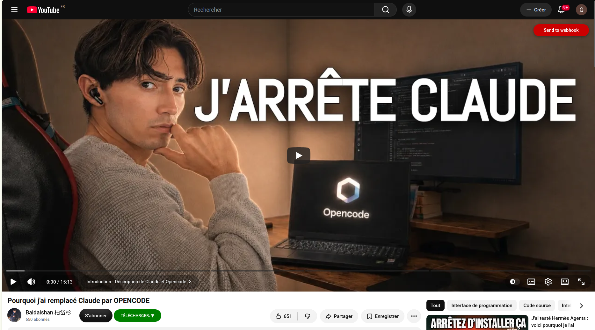

# YouTube Transcript → LLM Synthesis → Notion (n8n workflow)

n8n workflow that takes a YouTube video URL, pulls its transcript, rewrites it into a clean and structured document via an LLM, and pushes everything into a Notion database — with a built-in recovery path so nothing has to restart from scratch after a partial failure.

*The red "Send to webhook" button (top-right) is injected on YouTube video pages by the Tampermonkey userscript in [`userscript/`](userscript/) — one click sends the video to the n8n webhook.*

## What it does

1. **Trigger** — a webhook (`Start - Request from original userscript`) receives a `POST` with a video `title` and `url`, typically fired from a browser userscript running on YouTube.
2. **State tracking** — the request is immediately saved into an n8n Data Table (`Youtube_extractor_states`) so the run can be resumed later if anything fails downstream.
3. **Notion page creation** — the workflow searches the Notion "Vidéos" database for a page with that URL. If none exists, it creates one with the video title, URL, source (`Youtube`) and status (`Pending consultation`).
4. **State-driven routing** — a `Compute state` node combines the Notion page checkboxes (`Transcript`, `Transcript processé`) with whatever the Data Table already holds for that URL (raw and processed transcripts from earlier, possibly interrupted runs). Every following step is gated on that state, so the workflow only does the work that is actually missing and reuses stored transcripts instead of paying for Supadata or the LLM again.
5. **Transcript extraction** — only if no raw transcript is stored yet, it is fetched via [Supadata](https://supadata.ai) and saved to the Data Table.
6. **LLM rewrite** — only if no processed transcript is stored yet, the raw transcript is rewritten into a dense, well-structured Markdown document (not a summary — all information is preserved, filler and spoken-language noise removed). The primary model is Mistral Cloud, with an OpenRouter model (Qwen) configured as a fallback.
7. **Notion upload** — whichever of the processed (readable) transcript and the raw transcript is missing from the page is appended as Markdown blocks, the raw one under a collapsible "Transcript" toggle. Dollar signs in the raw transcript are escaped first: the raw transcript is a single paragraph, and two `$` in it would otherwise be parsed as an inline equation, which Notion rejects.
8. **Checkpointing** — after each step, the corresponding Notion checkboxes (`Transcript processé`, `Transcript`) and a `Log` field are updated, so the page itself reflects exactly how far processing got.
9. **Error handling** — any failure (transcript processing or Notion upload) is logged directly onto the Notion page's `Log` property and stops the execution with an explicit error, instead of failing silently.

## Recovery path

Because routing is driven by the actual state of the Notion page and the Data Table, the workflow is safe to re-run on any video at any point after a partial failure: it won't re-fetch a transcript it already has, won't call the LLM twice, won't duplicate the Notion page and won't append the same transcript twice.

There are three ways to re-run it:

- **Manual recovery button in Notion** (`Manual recovery from Notion button`): a URL button on the page that re-triggers the workflow through the same webhook path with the video URL.
- **Bulk recovery workflow** ([`recovery-workflow.json`](recovery-workflow.json), `Youtube_extractor_recovery`): reads every row of the Data Table, deduplicates them by URL, checks each video against Notion and calls the main workflow (through its `When called by recovery workflow` trigger) one video at a time for every page that is missing or incomplete. A `Config` node at the start controls it:
  - `dry_run` (default `true`): only classifies the videos (`complete` / `incomplete` / `missing`) and reports the result in the `Summary` node, without processing anything.
  - `only_url`: restricts the run to a single URL, handy for testing.
- **Re-sending the video** from the userscript.

## Requirements

- An [n8n](https://n8n.io/) instance (self-hosted or cloud) with:
  - [`n8n-nodes-supadata`](https://www.npmjs.com/package/n8n-nodes-supadata) community node
  - [`n8n-nodes-notion-markdown-unified`](https://www.npmjs.com/package/n8n-nodes-notion-markdown-unified) community node
  - LangChain nodes enabled (`@n8n/n8n-nodes-langchain`)
- Credentials for:
  - Supadata API
  - Notion API (integration with access to your target database)
  - Mistral Cloud API
  - OpenRouter API
- A Notion database with at least these properties:
  - `URL` (URL)
  - `Source` (Select)
  - `Status` (Select)
  - `Transcript` (Checkbox)
  - `Transcript processé` (Checkbox)
  - `Log` (Rich text)
- An n8n **Data Table** named `Youtube_extractor_states` with columns: `video_name`, `video_url`, `video_transcript`, `processed_transcript`, `interest_score`, `logs`, `Notion_page_URL`.
- A trigger source that `POST`s a video title and URL to the webhook. This repo includes a Tampermonkey userscript ([`userscript/youtube-webhook-sender.user.js`](userscript/youtube-webhook-sender.user.js)) that adds a "Send to webhook" button to every YouTube video page for that purpose.

  Note: the actual workflow trigger reads `body.title` and `body.url` (see the `Save webhook data` and `Normalize video URL` nodes), while the userscript below sends `title`, `url` and `videoId` — adjust either side to match the field names you use.

## Setup

1. Import [`workflow.json`](workflow.json) into your n8n instance.
2. Re-create the credentials listed above and re-link them on each node (the credential IDs in this export are placeholders).
3. Update the Notion `databaseId` and the Data Table `dataTableId` fields to point at your own database/table.
4. Set your own webhook path on the two webhook nodes (`Start - Request from original userscript` and `Manual recovery from Notion button` — both must share the same path, since the recovery button re-enters through the same entry point).
5. Add a URL/button property or block in Notion pointing at `https://<your-n8n-host>/webhook/<your-webhook-path>?url=<video url>&page_ID=<notion page id>` for the manual recovery path.
6. Update `WEBHOOK_URL` in [`userscript/youtube-webhook-sender.user.js`](userscript/youtube-webhook-sender.user.js) to match your webhook, and install it in Tampermonkey (or similar).
7. Activate (publish) the workflow. The recovery workflow calls the published version, so publish again after every change.
8. Optionally, import [`recovery-workflow.json`](recovery-workflow.json), point its `Process video with Youtube_extractor` node at your imported main workflow, and re-link its Notion credential and Data Table. Run it with `dry_run` set to `true` first.

## Notes on this export

The exported JSON files and the userscript have been anonymized before publishing: credential IDs, database/data-table IDs, the workflow ID referenced by the recovery workflow, the webhook path/URL, and an example execution payload (which contained a real IP address and hostname) have been replaced with placeholders. Replace them with your own values as described above.
